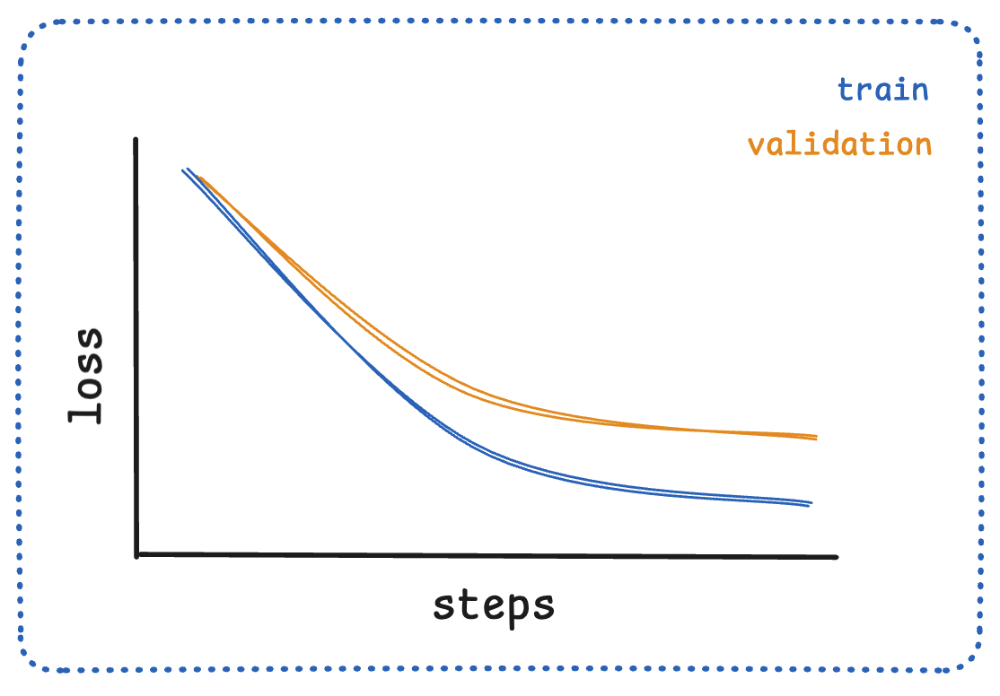
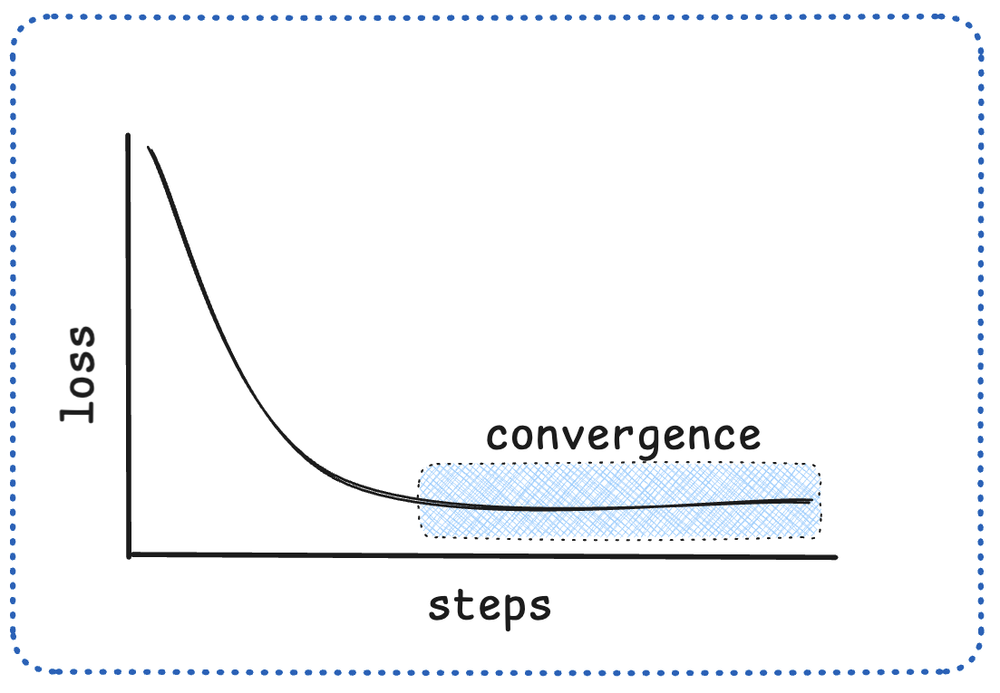
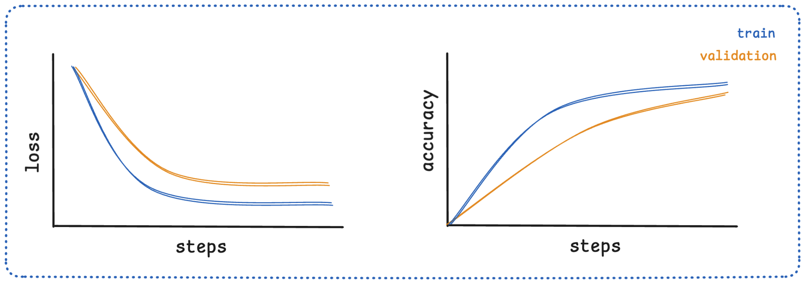
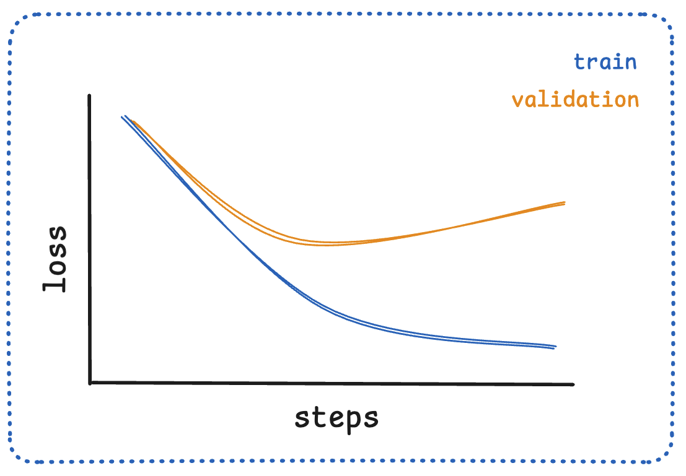
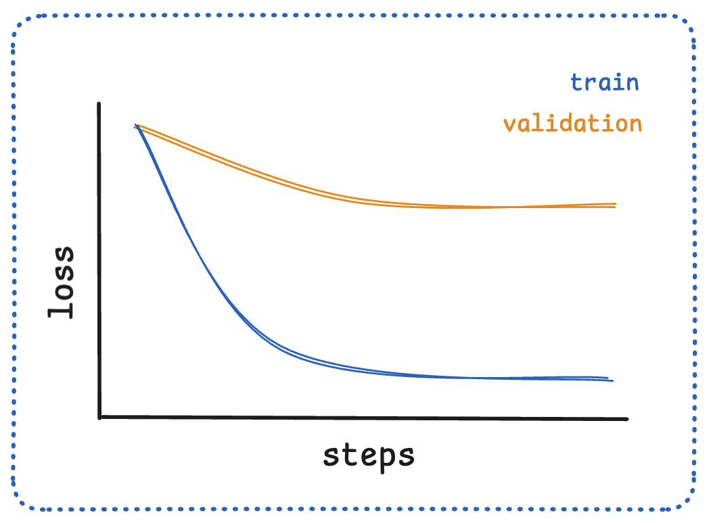
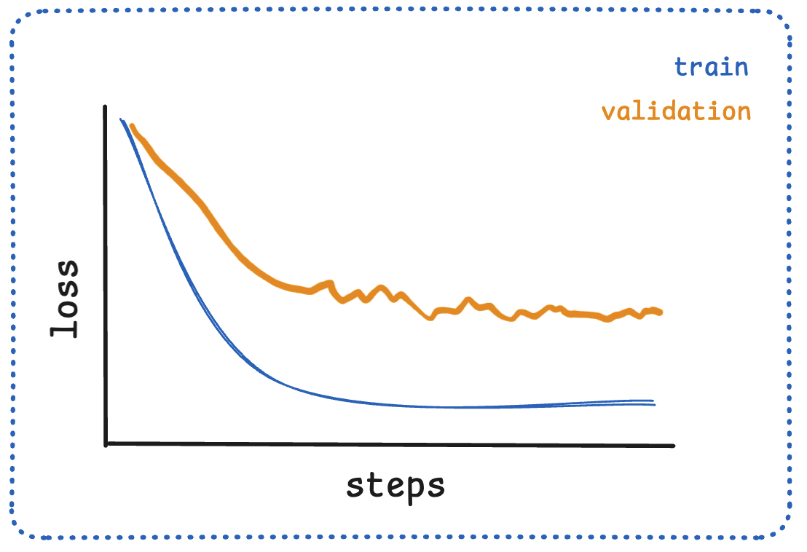
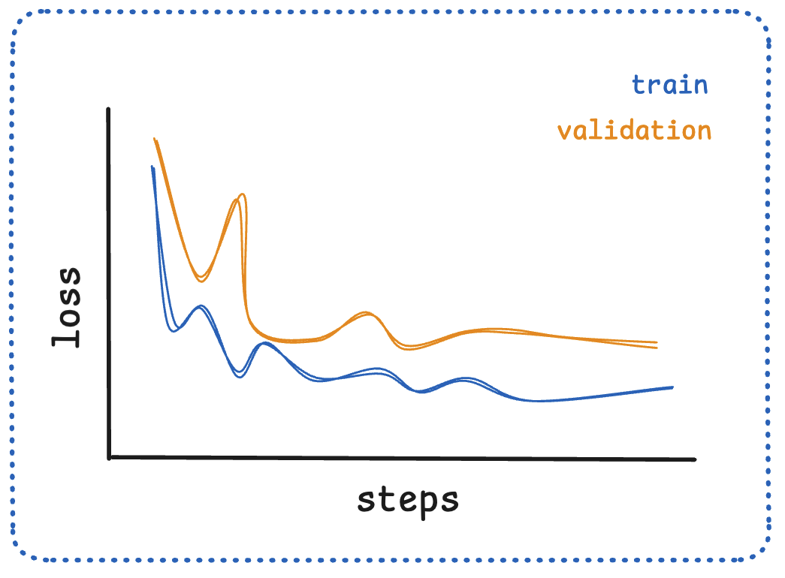

> **Uyarı:** Bu içerik, SCÜ Şarkışla UBYO Doğal Dil İşleme dersi kapsamında tamamen eğitim amaçlı çevrilmiş ve derlenmiştir. Orijinal dokümantasyon kaynakları (Hugging Face LLM Course, Transformers, Datasets, Tokenizers kütüphaneleri) kendi orijinal lisanslarına (Apache 2.0, MIT, CC-BY 4.0) tabidir. Bu çalışmanın hiçbir ticari amacı yoktur.

# Bölüm 03: İnce Ayar (Fine-Tuning) Temelleri

## 1. Giriş (Introduction)

[Bölüm 2](https://huggingface.co/course/chapter2)'de tahminler (çıkarım / *inference*) üretmek için tokenizer'ları ve önceden eğitilmiş modelleri nasıl kullanacağımızı incelemiştik. Peki ya önceden eğitilmiş bir modeli belirli bir görevi çözmek için ince ayar ile eğitmek (*fine-tune*) isterseniz? Bu bölümün konusu tam olarak budur! Bu bölümde şunları öğreneceksiniz:

- En güncel `🤗 Datasets` özelliklerini kullanarak Hub'dan büyük bir veri setini hazırlama
- Modern en iyi pratiklerle (*best practices*) bir modelde ince ayar yapmak için yüksek seviyeli `Trainer` API'sini kullanma
- Optimizasyon teknikleriyle sıfırdan özel bir eğitim döngüsü (*custom training loop*) uygulama
- Herhangi bir kurulumda dağıtık eğitimi (*distributed training*) kolayca çalıştırmak için `🤗 Accelerate` kütüphanesinden yararlanma
- Maksimum performans için güncel ince ayar en iyi pratiklerini uygulama

**İpucu**

📚 **Temel Kaynaklar:** Başlamadan önce veri işleme adımları için [🤗 Datasets dokümantasyonunu](https://huggingface.co/docs/datasets/) inceleyebilirsiniz.

Bu bölüm aynı zamanda `🤗 Transformers` kütüphanesinin ötesindeki bazı Hugging Face kütüphanelerine de bir giriş niteliğinde olacaktır! `🤗 Datasets`, `🤗 Tokenizers`, `🤗 Accelerate` ve `🤗 Evaluate` gibi kütüphanelerin modelleri daha verimli ve etkili bir şekilde eğitmenize nasıl yardımcı olabileceğini göreceğiz.

### Bölümün Ana Başlıkları:

- **Bölüm 2:** Modern veri ön işleme tekniklerini ve verimli veri seti yönetimini öğrenin
- **Bölüm 3:** Tüm en yeni özellikleriyle güçlü `Trainer` API'sinde uzmanlaşın
- **Bölüm 4:** Sıfırdan eğitim döngüleri uygulayın ve `Accelerate` ile dağıtık eğitimi kavrayın
- **Bölüm 5:** Öğrenme eğrilerini yorumlamayı ve yaygın eğitim sorunlarını çözmeyi öğrenin

Bu bölümün sonunda, hem yüksek seviyeli API’lerini hem de özel eğitim döngülerini kullanarak alandaki en son en iyi pratikleri uygulayabilecek ve modelleri kendi veri setleriniz üzerinde eğitebileceksiniz.

🎯 **Ne İnşa Edeceksiniz?** Bu bölümün sonunda metin sınıflandırma (*text classification*) için bir BERT modeline ince ayar yapmış olacak ve bu teknikleri kendi veri setlerinize ve görevlerinize nasıl uyarlayacağınızı anlayacaksınız.

Bu bölüm modern derin öğrenme araştırmaları ve üretim ortamları için standart haline geldiğinden yalnızca **PyTorch** üzerine odaklanmaktadır. Hugging Face ekosistemindeki en güncel API’lerini ve en iyi pratikleri kullanacağız.

---

## 2. Veriyi İşleme (Processing the Data)

Önceki bölümdeki örnekle devam edersek, tek bir batch (grup) üzerinde dizi sınıflandırıcıyı şu şekilde eğitebilirdik:

```
import torch
from torch.optim import AdamW
from transformers import AutoTokenizer, AutoModelForSequenceClassification

# Same as before
checkpoint = "bert-base-uncased"
tokenizer = AutoTokenizer.from_pretrained(checkpoint)
model = AutoModelForSequenceClassification.from_pretrained(checkpoint)
sequences = [
    "I've been waiting for a HuggingFace course my whole life.",
    "This course is amazing!",
]
batch = tokenizer(sequences, padding=True, truncation=True, return_tensors="pt")

# This is new
batch["labels"] = torch.tensor([1, 1])

optimizer = AdamW(model.parameters())
loss = model(**batch).loss
loss.backward()
optimizer.step()
```

Elbette modeli yalnızca iki cümle üzerinde eğitmek iyi sonuçlar vermeyecektir. Daha iyi sonuçlar elde etmek için daha büyük bir veri seti hazırlamanız gerekir.

Bu bölümde William B. Dolan ve Chris Brockett'in bir [makalesinde](https://www.aclweb.org/anthology/I05-5002.pdf) tanıtılan **MRPC (Microsoft Research Paraphrase Corpus)** veri setini örnek olarak kullanacağız. Veri seti, iki cümlenin birbirinin yeniden ifadesi (*paraphrase*) olup olmadığını (yani her iki cümlenin de aynı anlama gelip gelmediğini) gösteren bir etiketle birlikte 5.801 cümle çiftinden oluşur. Küçük bir veri seti olduğu ve üzerinde eğitim denemeleri yapmak kolay olduğu için bu bölüm için seçilmiştir.

### Hub'dan Veri Seti Yükleme (Loading a dataset from the Hub)

Hugging Face Hub yalnızca modelleri değil, aynı zamanda birçok farklı dilde çok sayıda veri setini de barındırır. Veri setlerine [buradan](https://huggingface.co/datasets) göz atabilirsiniz.

Şimdilik MRPC veri setine odaklanalım! Bu, makine öğrenimi modellerinin 10 farklı metin sınıflandırma görevindeki performansını ölçmek için kullanılan akademik bir kıyaslama paketi olan **GLUE benchmark**'ı oluşturan 10 veri setinden biridir.

`🤗 Datasets` kütüphanesi, Hub üzerindeki bir veri setini indirmek ve önbelleğe almak için çok basit bir komut sağlar:

```
from datasets import load_dataset

raw_datasets = load_dataset("glue", "mrpc")
raw_datasets
```

```
DatasetDict({
    train: Dataset({
        features: ['sentence1', 'sentence2', 'label', 'idx'],
        num_rows: 3668
    })
    validation: Dataset({
        features: ['sentence1', 'sentence2', 'label', 'idx'],
        num_rows: 408
    })
    test: Dataset({
        features: ['sentence1', 'sentence2', 'label', 'idx'],
        num_rows: 1725
    })
})
```

Gördüğünüz gibi, eğitim kümesini (*train*), doğrulama kümesini (*validation*) ve test kümesini içeren bir `DatasetDict` nesnesi elde ederiz. Bunların her biri birkaç sütun (`sentence1`, `sentence2`, `label` ve `idx`) ve her kümedeki öğe sayısı kadar satır içerir (eğitimde 3.668, doğrulamada 408 ve testte 1.725 çift).

Bu komut veri setini varsayılan olarak `~/.cache/huggingface/datasets` dizinine indirir ve önbelleğe alır.

`raw_datasets` nesnemizdeki her bir cümle çiftine tıpkı bir sözlük gibi indeksleme yaparak erişebiliriz:

```
raw_train_dataset = raw_datasets["train"]
raw_train_dataset[0]
```

```
{'idx': 0,
 'label': 1,
 'sentence1': 'Amrozi accused his brother , whom he called " the witness " , of deliberately distorting his evidence .',
 'sentence2': 'Referring to him as only " the witness " , Amrozi accused his brother of deliberately distorting his evidence .'}
```

Etiketlerin zaten tam sayı (*integer*) olduğunu görebiliriz, dolayısıyla orada herhangi bir ön işleme yapmamız gerekmeyecek. Hangi tamsayının hangi etikete karşılık geldiğini öğrenmek için `features` özelliğini inceleyebiliriz:

```
raw_train_dataset.features
```

```
{'sentence1': Value(dtype='string', id=None),
 'sentence2': Value(dtype='string', id=None),
 'label': ClassLabel(num_classes=2, names=['not_equivalent', 'equivalent'], names_file=None, id=None),
 'idx': Value(dtype='int32', id=None)}
```

`label`, `ClassLabel` türündedir ve tamsayıların etiket adlarıyla eşleşmesi `names` listesinde saklanır: `0` değeri `not_equivalent` (eşdeğer değil), `1` değeri ise `equivalent` (eşdeğer) anlamına gelir.

---

### Veri Setini Ön İşleme (Preprocessing a dataset)

Veri setini ön işlemek için metni modelin anlayabileceği sayılara dönüştürmemiz gerekir. Bu işlem bir tokenizer ile yapılır. Tokenizer bir çift diziyi alabilir ve BERT modelimizin beklediği şekilde hazırlayabilir:

```
inputs = tokenizer("This is the first sentence.", "This is the second one.")
inputs
```

```
{
  'input_ids': [101, 2023, 2003, 1996, 2034, 6251, 1012, 102, 2023, 2003, 1996, 2117, 2028, 1012, 102],
  'token_type_ids': [0, 0, 0, 0, 0, 0, 0, 0, 1, 1, 1, 1, 1, 1, 1],
  'attention_mask': [1, 1, 1, 1, 1, 1, 1, 1, 1, 1, 1, 1, 1, 1, 1]
}
```

`token_type_ids`, modele girdinin hangi bölümünün birinci cümle, hangi bölümünün ikinci cümle olduğunu söyler. Token ID'lerini kelimelere geri dönüştürürsek:

```
tokenizer.convert_ids_to_tokens(inputs["input_ids"])
```

```
['[CLS]', 'this', 'is', 'the', 'first', 'sentence', '.', '[SEP]', 'this', 'is', 'the', 'second', 'one', '.', '[SEP]']
```

Görüldüğü gibi model iki cümle olduğunda girdilerin `[CLS] sentence1 [SEP] sentence2 [SEP]` biçiminde olmasını bekler. `[CLS] sentence1 [SEP]` kısmına karşılık gelen token türü kimliği `0`, `sentence2 [SEP]` kısmına karşılık gelen token türü kimliği ise `1` olur.

> [!NOT] BERT, token türü kimlikleriyle önceden eğitilmiştir ve Maskeli Dil Modelleme hedefinin yanı sıra **Sonraki Cümle Tahmini (Next Sentence Prediction - NSP)** adlı ek bir hedefe sahiptir. Bu görevin amacı cümle çiftleri arasındaki ilişkiyi modellemektir. DistilBERT gibi bazı modeller bu parametreyi kullanmaz.

Tüm veri setini tokenize etmek için veriyi RAM'de tutmak yerine diskte **Apache Arrow** formatında koruyan `Dataset.map()` yöntemini kullanırız:

```
def tokenize_function(example):
    return tokenizer(example["sentence1"], example["sentence2"], truncation=True)

tokenized_datasets = raw_datasets.map(tokenize_function, batched=True)
tokenized_datasets
```

```
DatasetDict({
    train: Dataset({
        features: ['attention_mask', 'idx', 'input_ids', 'label', 'sentence1', 'sentence2', 'token_type_ids'],
        num_rows: 3668
    })
    validation: Dataset({
        features: ['attention_mask', 'idx', 'input_ids', 'label', 'sentence1', 'sentence2', 'token_type_ids'],
        num_rows: 408
    })
    test: Dataset({
        features: ['attention_mask', 'idx', 'input_ids', 'label', 'sentence1', 'sentence2', 'token_type_ids'],
        num_rows: 1725
    })
})
```

`batched=True` seçeneği, Rust ile yazılmış hızlı tokenizer'ın çoklu iş parçacığıyla (*multithreading*) çalışmasını sağlayarak ön işlemeyi ciddi ölçüde hızlandırır.

---

### Dinamik Dolgulama (Dynamic Padding)

Bir batch içindeki örnekleri bir araya getirmekten sorumlu fonksiyona **collate fonksiyonu** denir. Tüm örnekleri peşinen tüm veri setindeki en uzun elemana kadar doldurmak (*padding*) hesaplama gücünü ve belleği israf eder. Bunun yerine örnekleri batch oluştururken yalnızca **o batch içindeki en uzun elemanın boyuna kadar** doldururuz; buna **dinamik dolgulama (dynamic padding)** denir.

`🤗 Transformers`, `DataCollatorWithPadding` ile bu işlemi otomatik olarak gerçekleştirir:

```
from transformers import DataCollatorWithPadding

data_collator = DataCollatorWithPadding(tokenizer=tokenizer)

samples = tokenized_datasets["train"][:8]
samples = {k: v for k, v in samples.items() if k not in ["idx", "sentence1", "sentence2"]}
[len(x) for x in samples["input_ids"]]
```

```
[50, 59, 47, 67, 59, 50, 62, 32]
```

Bu 8 örneği birleştirdiğimizde:

```
batch = data_collator(samples)
{k: v.shape for k, v in batch.items()}
```

```
{
  'attention_mask': torch.Size([8, 67]),
  'input_ids': torch.Size([8, 67]),
  'token_type_ids': torch.Size([8, 67]),
  'labels': torch.Size([8])
}
```

Örneklerin tamamı sabit bir maksimum uzunluk yerine, batch içindeki en uzun değer olan **67**'ye dinamik olarak eşitlenmiştir.

---

## 3. Trainer API ile Bir Modelin İnce Ayarı (Fine-Tuning a Model with the Trainer API)

`Trainer` sınıfı, modelleri modern en iyi pratiklerle veri setiniz üzerinde ince ayar yapmanıza olanak tanır.

### Eğitim Argümanları ve Model Tanımlama

İlk adım, eğitim hiperparametrelerini tanımlamaktır:

```
from transformers import TrainingArguments

training_args = TrainingArguments("test-trainer")
```

İkinci adım, modeli iki etiketle başlatmaktır:

```
from transformers import AutoModelForSequenceClassification

model = AutoModelForSequenceClassification.from_pretrained(checkpoint, num_labels=2)
```

**Not**

Bu aşamada BERT'in orijinal ön eğitim başlığı (*head*) atıldığı ve yerine yeni rastgele başlatılan bir sınıflandırma başlığı eklendiği için bazı ağırlıkların kullanılmadığına dair bir uyarı (*warning*) alırsınız. Bu tamamen beklenen bir durumdur.

Artık `Trainer`'ı oluşturabiliriz:

```
from transformers import Trainer

trainer = Trainer(
    model,
    training_args,
    train_dataset=tokenized_datasets["train"],
    eval_dataset=tokenized_datasets["validation"],
    data_collator=data_collator,
    processing_class=tokenizer,
)

trainer.train()
```

---

### Değerlendirme (Evaluation) ve `compute_metrics`

Model tahminlerini değerlendirmek ve insan tarafından anlaşılabilir metrikler (Accuracy, F1) elde etmek için `🤗 Evaluate` kütüphanesini kullanırız:

```
import evaluate
import numpy as np

def compute_metrics(eval_preds):
    metric = evaluate.load("glue", "mrpc")
    logits, labels = eval_preds
    predictions = np.argmax(logits, axis=-1)
    return metric.compute(predictions=predictions, references=labels)
```

Her turun sonunda metriklerin hesaplanmasını sağlamak için `eval_strategy="epoch"` parametresiyle yeni bir `Trainer` başlatırız:

```
training_args = TrainingArguments("test-trainer", eval_strategy="epoch")
model = AutoModelForSequenceClassification.from_pretrained(checkpoint, num_labels=2)

trainer = Trainer(
    model,
    training_args,
    train_dataset=tokenized_datasets["train"],
    eval_dataset=tokenized_datasets["validation"],
    data_collator=data_collator,
    processing_class=tokenizer,
    compute_metrics=compute_metrics,
)

trainer.train()
```

### Gelişmiş Eğitim Özellikleri:

- **Karma Hassasiyetli Eğitim (Mixed Precision):** `fp16=True`
- **Gradyan Biriktirme (Gradient Accumulation):** `gradient_accumulation_steps=4`
- **Öğrenme Oranı Zamanlayıcısı:** `lr_scheduler_type="cosine"`

---

## 4. Özel Bir PyTorch Eğitim Döngüsü ile İnce Ayar (A Full Training Loop)

Trainer kullanmadan, saf PyTorch ile tam kontrol sahibi olduğumuz bir döngü yazalım.

### Veriyi Hazırlama

```
tokenized_datasets = tokenized_datasets.remove_columns(["sentence1", "sentence2", "idx"])
tokenized_datasets = tokenized_datasets.rename_column("label", "labels")
tokenized_datasets.set_format("torch")

from torch.utils.data import DataLoader

train_dataloader = DataLoader(
    tokenized_datasets["train"], shuffle=True, batch_size=8, collate_fn=data_collator
)
eval_dataloader = DataLoader(
    tokenized_datasets["validation"], batch_size=8, collate_fn=data_collator
)
```

### Optimizer ve Learning Rate Scheduler

```
from torch.optim import AdamW
from transformers import AutoModelForSequenceClassification, get_scheduler

model = AutoModelForSequenceClassification.from_pretrained(checkpoint, num_labels=2)
optimizer = AdamW(model.parameters(), lr=5e-5)

num_epochs = 3
num_training_steps = num_epochs * len(train_dataloader)
lr_scheduler = get_scheduler(
    "linear",
    optimizer=optimizer,
    num_warmup_steps=0,
    num_training_steps=num_training_steps,
)
```

### Eğitim ve Değerlendirme Döngüsü

```
import torch
from tqdm.auto import tqdm
import evaluate

device = torch.device("cuda") if torch.cuda.is_available() else torch.device("cpu")
model.to(device)

progress_bar = tqdm(range(num_training_steps))

model.train()
for epoch in range(num_epochs):
    for batch in train_dataloader:
        batch = {k: v.to(device) for k, v in batch.items()}
        outputs = model(**batch)
        loss = outputs.loss
        loss.backward()

        optimizer.step()
        lr_scheduler.step()
        optimizer.zero_grad()
        progress_bar.update(1)

# Değerlendirme
metric = evaluate.load("glue", "mrpc")
model.eval()
for batch in eval_dataloader:
    batch = {k: v.to(device) for k, v in batch.items()}
    with torch.no_grad():
        outputs = model(**batch)

    logits = outputs.logits
    predictions = torch.argmax(logits, dim=-1)
    metric.add_batch(predictions=predictions, references=batch["labels"])

metric.compute()
```

### `🤗 Accelerate` ile Dağıtık Eğitime Geçiş

```
from accelerate import Accelerator

accelerator = Accelerator()

train_dl, eval_dl, model, optimizer = accelerator.prepare(
    train_dataloader, eval_dataloader, model, optimizer
)

num_training_steps = num_epochs * len(train_dl)
lr_scheduler = get_scheduler(
    "linear",
    optimizer=optimizer,
    num_warmup_steps=0,
    num_training_steps=num_training_steps,
)

model.train()
for epoch in range(num_epochs):
    for batch in train_dl:
        outputs = model(**batch)
        loss = outputs.loss
        accelerator.backward(loss)

        optimizer.step()
        lr_scheduler.step()
        optimizer.zero_grad()
```

Çalıştırmak için:

```
accelerate config
accelerate launch train.py
```

---

## 5. Öğrenme Eğrilerini Anlamak (Understanding Learning Curves)

Öğrenme eğrileri (*learning curves*), modelin eğitim sürecindeki başarımını ve ortaya çıkabilecek sorunları görselleştirmeye yardımcı olan temel araçlardır.

### Kayıp Eğrileri (Loss Curves)

Kayıp eğrileri, eğitim ve doğrulama kaybının adımlar (*steps*) veya dönemler (*epochs*) boyunca nasıl değiştiğini gösterir. Kayıp sürekli ve düzenli biçimde azalmak zorunda değildir; eğitim sırasında dalgalanabilir.



- **Yüksek başlangıç kaybı:** Model henüz optimize edilmediğinden başlangıçta tahminleri zayıftır.
- **Azalan kayıp:** Eğitim ilerledikçe kaybın genel olarak azalması beklenir.
- **Yakınsama:** Zamanla kayıp düşük bir değerde dengelenir. Bu, modelin verideki örüntüleri öğrendiğini gösterir.



Önceki bölümlerde olduğu gibi, bu ölçümleri izlemek ve bir gösterge panelinde görselleştirmek için `Trainer` API'sini kullanabiliriz. Aşağıda, bunu Weights & Biases ile yapmaya yönelik bir örnek verilmiştir.

```python
# Trainer ile eğitim sırasında kaybın izlenmesine örnek
from transformers import Trainer, TrainingArguments
import wandb

# Deney takibi için Weights & Biases'i başlat
wandb.init(project="transformer-fine-tuning", name="bert-mrpc-analysis")

training_args = TrainingArguments(
    output_dir="./results",
    eval_strategy="steps",
    eval_steps=50,
    save_steps=100,
    logging_steps=10,  # Ölçümleri her 10 adımda bir kaydet
    num_train_epochs=3,
    per_device_train_batch_size=16,
    per_device_eval_batch_size=16,
    report_to="wandb",  # Kayıtları Weights & Biases'e gönder
)

trainer = Trainer(
    model=model,
    args=training_args,
    train_dataset=tokenized_datasets["train"],
    eval_dataset=tokenized_datasets["validation"],
    data_collator=data_collator,
    processing_class=tokenizer,
    compute_metrics=compute_metrics,
)

# Eğitimi başlat ve ölçümleri otomatik olarak kaydet
trainer.train()
```

### Doğruluk Eğrileri (Accuracy Curves)

Doğruluk eğrileri, modelin doğru tahminlerinin oranını gösterir. Doğruluk değerleri sonlu bir değerlendirme kümesinde belirli adımlarla değişebileceği için eğri basamaklı görünebilir.



### Yaygın Eğitim Sorunları ve Çözümleri

1. **Aşırı öğrenme (overfitting):** Eğitim kaybı azalırken doğrulama kaybı artmaya başlar.
   - **Çözüm:** Düzenlileştirme (*regularization*), veri artırma (*data augmentation*) veya `EarlyStoppingCallback(early_stopping_patience=3)` ile erken durdurma kullanılabilir.

   

   

2. **Eksik öğrenme (underfitting):** Eğitim ve doğrulama kayıpları yüksek kalır.
   - **Çözüm:** Daha büyük bir model kullanmak, eğitim dönemlerinin sayısını artırmak veya öğrenme oranını yükseltmek düşünülebilir.

3. **Dalgalı eğriler (erratic curves):** Kayıp değerlerinde keskin iniş çıkışlar ve kararsızlık görülür.
   - **Çözüm:** Öğrenme oranını düşürmek, batch boyutunu artırmak veya gradyan kırpma (*gradient clipping*) uygulamak yardımcı olabilir.

   

   

---

## 6. Bölüm Özeti (Fine-tuning, Check!)

Tebrikler! İlk iki bölümde modelleri ve tokenizer'ları öğrendiniz; bu bölümde ise modern en iyi pratikleri kullanarak bunları kendi verileriniz için nasıl ince ayar ile eğiteceğinizi kavradınız.

### Bu Bölümde Başardıklarınız:

- **Hub Veri Setleri:** Hugging Face Hub üzerindeki veri setlerini ve modern veri işleme tekniklerini öğrendiniz.
- **Verimli Ön İşleme:** Dinamik padding ve data collator'lar dahil olmak üzere verileri verimli bir şekilde yüklemeyi ve ön işlemeyi uyguladınız.
- **Trainer API:** En güncel özelliklerle yüksek seviyeli Trainer API'sini kullanarak ince ayar ve değerlendirme gerçekleştirdiniz.
- **Özel Eğitim Döngüsü:** PyTorch ile sıfırdan eksiksiz bir özel eğitim döngüsü inşa ettiniz.
- **Dağıtık Eğitim:** Eğitim kodunuzun birden çok GPU veya TPU üzerinde sorunsuz çalışmasını sağlamak için `🤗 Accelerate` kullandınız.
- **Modern Optimizasyonlar:** Karma hassasiyetli eğitim (*mixed precision*) ve gradyan biriktirme (*gradient accumulation*) gibi modern optimizasyon tekniklerini uyguladınız.
